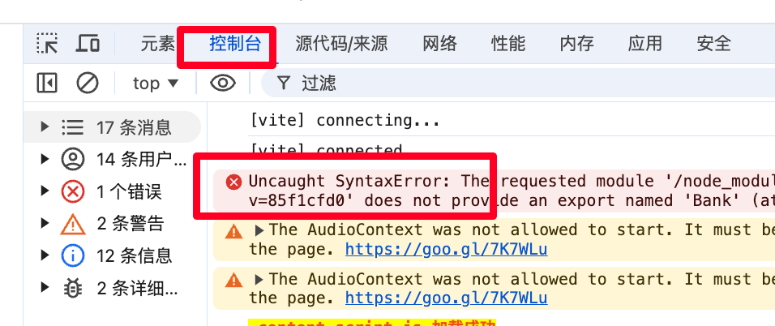

#  投资理财大富翁 fp-monopoly

原始仓库：
https://github.com/Jackiexiao/startup-monopoly/

##  我跟 AI 的对话，将上面的仓库改成本仓库
```
可以帮我缩减 board.ts 的布局吗，现在 PropertySpace 太多了，现在是  11 + 11 + 9 + 9 的格局，我觉得 6 + 6 + 4 + 4 差不多了
```

```
很棒！接下来
请帮我把这个游戏改成理财主题的游戏

我们的活动主题：

将奥⻢哈⼈巴菲特的投资智慧与现代AI科技相结合，在轻松的酒馆氛围中，让每个参与者都能获得专
属的AI投资顾问体验，共同探讨投资

请让这个游戏尽可能有趣好玩一点，让大家都能玩的开心

修改所有对应的文字，UI 换成酒馆风格
```


```
 帮我修改标题
```

## FAQ
### 修改后出现 白屏错误

你需要 F12 或者右键网页打开“检查”/开发者工具

然后选择控制台，可以看到具体的报错，复制发给 AI

